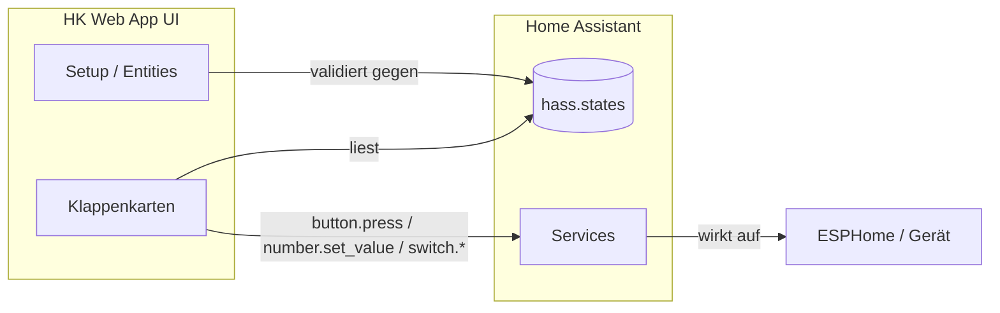
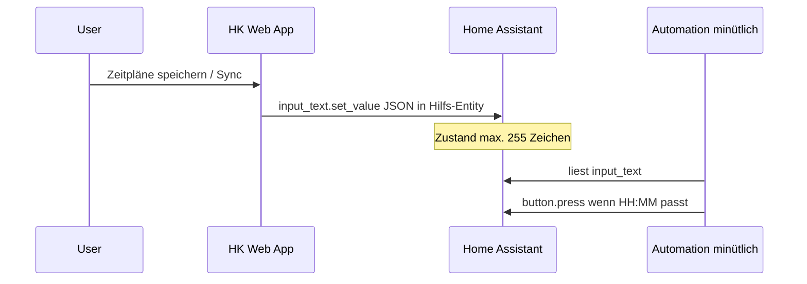

# Anforderungen – Home Assistant App (Add-on) „HK Web App“

Dieses Dokument beschreibt die funktionalen und technischen Anforderungen für die **Home-Assistant-App** (Docker-Container; umgangssprachlich oft „Add-on“) im Ordner **HA ADDON HK APP**. Inhaltlich basiert es auf der bestehenden **HK Web App** (`liquid-glass-app.js` im Projektordner `APP Web app HA/hkweb-app` bzw. aktuelle Releases wie `hkweb-app-v2.1.x`) und auf `APP Web app HA/APP Anforderungen.MD`.

**Ziel:** Gleiche Nutzerfunktionen und HA-Anbindung wie die Panel-Web-App, bereitgestellt als installierbare HA-App mit eigenem Dienst/Frontend im Supervisor-Kontext.

---

## 1. Einordnung und Laufzeitumgebung

- Die Referenz-Implementierung ist ein **LitElement-Panel** für Home Assistant mit Zugriff auf das Objekt **`hass`**:
  - `hass.states` – aktuelle Zustände aller Entities
  - `hass.callService` – Aufruf von Home-Assistant-Services
- **Ohne** verbundenes Home Assistant und integrierte Geräte (z. B. ESPHome) ist keine Klappensteuerung möglich.
- Die HA-App muss **mit derselben HA-API** arbeiten (Services, States); die genaue Einbettung (eingebettetes Web-Frontend vs. iframe/Proxy) ist Implementierungsdetail, die **fachlichen** Anforderungen bleiben gleich.

---

## 2. Steuerung über Home-Assistant-Services

| Aktion | Service | Parameter |
|--------|---------|-----------|
| Öffnen, Schließen, Stop (und optionale Buttons) | `button.press` | `entity_id`: konfigurierter Button |
| Motor-Parameter (Geschwindigkeit, Beschleunigung) | `number.set_value` | `entity_id`, `value` (an min/max der Entity klemmen) |
| Schalter (z. B. Motor Enable) | `switch.turn_on` / `switch.turn_off` | `entity_id` |
| Zeitplan-Sync (zentrale Hilfs-Entity) | `input_text.set_value` | `entity_id`, `value` (JSON-String) |

Vor Service-Aufrufen soll geprüft werden, ob die Entity in `hass.states` existiert; Fehler werden im **internen Log** der App festgehalten (wie in der Web-App).

---

## 3. Pro Klappe konfigurierbare Entities

Die Zuordnung erfolgt in der App (Tab **Setup**), persistent gespeichert (Referenz: **localStorage** in der Browser-App; in der HA-App: gleiche Datenstruktur, Speicherort z. B. Browser-LocalStorage des eingebetteten UI oder Add-on-seitige Konfiguration – **fachlich** identisch).

### 3.1 Kategorien

1. **Status / Anzeige** (Zustand als `state`-String)
   - Status (Hauptanzeige)
   - optional: Zustand, letzte Aktion
   - optional: Endschalter oben/unten (Text oder z. B. `on`/`off`)

2. **Buttons**
   - Öffnen, Schließen, Stop
   - optional: Treiber-Reset, Zentrale

3. **Motor**
   - optional: Number-Entities für Parameter (z. B. Max-Speed, Beschleunigung)
   - optional: Switch „Motor Enable“

### 3.2 Standard-HK1-Entity-IDs (Referenz)

| Feld | Beispiel-Default |
|------|------------------|
| Status | `sensor.hk1_status_hk1` |
| Letzte Aktion | `sensor.hk1_letzte_aktion` |
| Endschalter oben/unten | `sensor.hk1_endschalter_hk1_oben` / `…_unten` |
| Öffnen / Schließen / Stop | `button.hk1_hk1_offnen`, `button.hk1_hk1_schliessen`, `button.hk1_hk1_stop` |
| Max-Speed / Beschleunigung | `number.hk1_hk1_max_speed`, `number.hk1_hk1_beschleunigung` |
| Motor Enable | `switch.hk1_motor_enable` |

**Hinweis:** Tatsächliche `entity_id`-Werte hängen von ESPHome-`name` und Gerätenamen ab; Abgleich über **Setup** oder angepasste Namensgebung in ESPHome.

---

## 4. Anzeige- und UI-Erwartungen

- **Statuszeile:** aus `state` des Status-/Zustand-Entity; für Darstellung u. a. erkennen: „offen“, „geschlossen“, „in bewegung“/„in fahrt“, „störung“ (groß/klein tolerant).
- **Klappenkarte:** Details (letzte Aktion, Endschalter, Motor aktiv), wenn Entities gesetzt und erreichbar sind.
- **Motor-Slider** (wo vorgesehen, z. B. HK1 mit Speed/Accel): Spanne aus **min/max der HA-Number-Entity**; Wert per `number.set_value`.

---

## 5. Firmware / ESPHome (Referenz, keine App-Logik)

Die App ersetzt keine Sicherheitslogik auf dem Gerät. Die Firmware soll mindestens bereitstellen:

- Aktionen **Öffnen**, **Schließen**, **Stop**
- **Endschalter** oben/unten
- optional: Stromüberwachung mit Abschaltung
- nachvollziehbare **Status-/Text-Sensoren** für HA

---

## 6. Modi (Zeitpläne, Tag/Nacht, Sicherheit)

Pro Klappe (persistent):

- **Modus:** manuell, Zeitpläne oder Tag/Nacht
- **Zeitpläne:** Listen für Öffnen- und Schließen-Uhrzeiten (`HH:MM`)
- **Tag/Nacht:** PLZ, Offsets zu Sonnenauf-/-untergang (Anzeige/Konfiguration in der App)
- **Sicherheit:** Sicherheitsschließzeiten; optional „im manuellen Modus anwenden“

### 6.1 Ausführung der Zeitpläne in Home Assistant

Die **Ausführung** erfolgt nicht allein in der App, sondern durch eine **Automatisierung** in HA (typisch: minütlicher Takt), die ein zentrales **JSON** aus einer Hilfs-**`input_text`**-Entity liest und zur passenden Minute **`button.press`** auslöst. Beispiel: `APP Web app HA/HA_ZEITPLAENE_AUTOMATION_fuer_include_dir.yaml` (Entity-ID `input_text` anpassen).

In den **Einstellungen** der App wird **eine** zentrale `input_text`-Entity eingetragen. Die App schreibt per `input_text.set_value` ein **Sammel-JSON** für alle Klappen.

**Kompaktformat (Referenz ab v2.1.15+, v2):**

- Wurzel: `v: 2`, `k: { <klappenId>: { … } }`
- Pro Klappe u. a.: `m` = Modus-Kürzel (`s` = schedule, `d` = daynight, `n` = manual), bei Zeitplan `o` / `c` = Öffnen- bzw. Schließen-Zeiten, `b` / `d` = Button-IDs für Öffnen/Schließen
- **Begrenzung:** HA-Entity-Zustände sind oft **max. 255 Zeichen** – zu lange JSON-Strings werden von HA nicht übernommen; die Referenz-App bricht dann den Sync ab und protokolliert das.

**Hinweis:** Modus **Tag/Nacht** in der App ist weiterhin primär **Konfiguration/Anzeige**; vollständige Ausführung über Sonnen-Trigger erfordert **zusätzliche** HA-Automatisierungen (nicht in der Beispiel-Zeitplan-Datei enthalten).

---

## 7. Externe APIs (nur Client / Browser-Kontext)

Für **Tag/Nacht** und Sonnenzeiten (wenn genutzt):

1. **OpenStreetMap Nominatim** – PLZ → Koordinaten (sinnvoller User-Agent)
2. **sunrise-sunset.org** – Sonnenauf- und -untergang aus lat/lon

Der Client benötigt **Internetzugang**; bei Fehlern können **Fallback-Zeiten** (jahreszeitabhängig) greifen.

---

## 8. Setup, Qualitätssicherung, Mehrklappen

- Tab **Setup:** Eingabe aller Entity-IDs pro Klappe; Abgleich mit `hass.states`.
- **Entities prüfen:** schrittweise Prüfung mit Fortschritt und Zusammenfassung (gültig/ungültig/nicht konfiguriert).
- Mehrere Klappen (**HK1, HK2, HK3, …**); nicht alle müssen vollständig belegt sein.
- Tab **Einstellungen:** u. a. zentrale `input_text` für Zeitplan-Sync, ggf. Theme/Transparenz wie in der Referenz-UI.

---

## 9. Abgrenzung und offene Projektbezüge

- Abgleich **App-Defaults ↔ ESPHome-YAML** ist beim Rollout manuell sicherzustellen.
- Projektdateien wie `TO DO.txt` oder Hardware-Dokumentation betreffen nicht direkt die App-Logik, können aber Randbedingungen liefern.

---

## 10. Kurz-Checkliste für den Betrieb

1. Home Assistant mit ESPHome-Integration und Gerät(en) für die Klappe(n).
2. Entity-IDs in der App mit **Entwicklerwerkzeuge → Zustände** abgleichen.
3. Buttons in HA testen (`button.press`).
4. Für automatische Zeitpläne: **`input_text`** + **Automatisierung** wie in den Beispiel-YAMLs; Entity-IDs konsistent eintragen.
5. Optional: PLZ / Netzwerk für Nominatim und Sonnen-API.

---

## 11. Funktionsweisen (Skizze)

### 11.1 Gesamtfluss Steuerung

### 11.2 Zeitplan: App → HA → Automatisierung

### 11.3 Datenhaltung (Referenz Web-App)

- **Klappen-Config** (Entity-IDs, Namen): persistent, Key z. B. `hkweb_klappen_config`.
- **Modi** (Zeitpläne, Tag/Nacht, Sicherheit): persistent, z. B. `hkweb_klappen_modi`.
- **Globale Einstellungen:** PLZ, Theme, Sidebar, zentrale `input_text` für Sync – analog zur Referenz-Implementierung.

Die HA-App soll diese **fachliche** Struktur beibehalten; der **Speicherort** kann an die Add-on-Architektur angepasst werden, solange Verhalten und HA-Schnittstelle gleich bleiben.

---

## 12. Bezug zur Quelle

| Quelle | Inhalt |
|--------|--------|
| `APP Web app HA/APP Anforderungen.MD` | Ausgangsdokument (Abschnitte 1–10) |
| `APP Web app HA/hkweb-app/liquid-glass-app.js` | Implementierung (LitElement, Services, Config) |
| Neuere Releases `hkweb-app-v2.1.x` | u. a. Zeitplan-Sync `input_text`, kompaktes JSON v2 |
| `APP Web app HA/HA_ZEITPLAENE_AUTOMATION*.yaml` | Beispiel-Automatisierung für minütliche Ausführung |

*Stand der Zusammenstellung: Abgleich mit Projektstand März 2026.*
