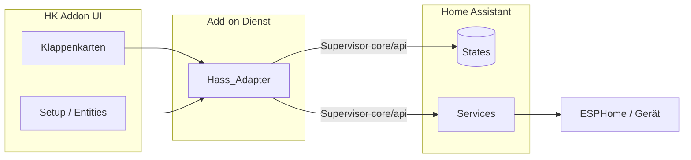
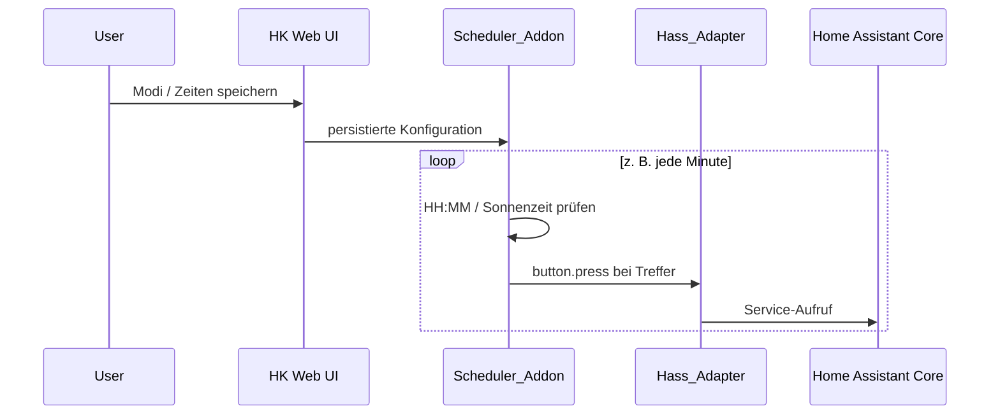

# Anforderungen – Home Assistant App (Add-on) „HK Addon“

Dieses Dokument beschreibt die funktionalen und technischen Anforderungen für die **Home-Assistant-App** (Docker-Container; umgangssprachlich oft „Add-on“) im Ordner **HA ADDON HK APP**. Inhaltlich basiert es auf der bestehenden **HK Web App** (`liquid-glass-app.js` im Projektordner `APP Web app HA/hkweb-app` bzw. aktuelle Releases wie `hkweb-app-v2.1.x`) und auf `APP Web app HA/APP Anforderungen.MD`.

**Ziel:** Gleiche Nutzerfunktionen und HA-Anbindung wie die Panel-Web-App, bereitgestellt als installierbare HA-App mit eigenem Dienst/Frontend im Supervisor-Kontext. Die Oberfläche muss **für die Nutzung am Smartphone** (und sinnvoll auch am Tablet) **ausgelegt** sein – nicht nur als Nebenprodukt der Desktop-Ansicht.

**Add-on-spezifisch:** **Ansteuerung der Entities** und **Ausführung der Zeitpläne** (inkl. Tag/Nacht nach denselben Konfigurationsregeln) erfolgen **direkt im Add-on** über die angebundene Home-Assistant-API – ohne dass dafür eine minütliche **Automatisierung** in HA oder ein **`input_text`**-Sync für die Laufzeit zwingend nötig sind.

---

## 1. Einordnung und Laufzeitumgebung

- Die Referenz-Implementierung (Browser-Panel) ist ein **LitElement-Panel** für Home Assistant mit Zugriff auf das Objekt **`hass`**:
  - `hass.states` – aktuelle Zustände aller Entities
  - `hass.callService` – Aufruf von Home-Assistant-Services
- **Ohne** verbundenes Home Assistant und integrierte Geräte (z. B. ESPHome) ist keine Klappensteuerung möglich.
- Die HA-App (Add-on) nutzt dieselbe **HA-API** (States, Services) wie die Web-App – **fachlich** identisch zu `hass.states` / `hass.callService`.
- **Technik (Supervisor-Standard):** Mit `homeassistant_api: true` in der App-Konfiguration stellt der **Supervisor** die Umgebungsvariable **`SUPERVISOR_TOKEN`** bereit. Der Add-on-Dienst spricht den Home-Assistant-Core über den internen Proxy **`http://supervisor/core/api`** (REST) und optional **`ws://supervisor/core/websocket`** (WebSocket) an – jeweils mit `Authorization: Bearer <SUPERVISOR_TOKEN>`. **Kein** manuell anzulegender Long-Lived Access Token in den Add-on-Optionen ist dafür nötig (siehe [App communication](https://developers.home-assistant.io/docs/apps/communication)). Die Browser-UI spricht nur mit dem Add-on (z. B. REST-Proxy); sie hat kein direktes `hass`-Objekt wie das Lovelace-Panel.

---

## 2. Steuerung über Home-Assistant-Services

| Aktion | Service | Parameter |
|--------|---------|-----------|
| Öffnen, Schließen, Stop (und optionale Buttons) | `button.press` | `entity_id`: konfigurierter Button |
| Motor-Parameter (Geschwindigkeit, Beschleunigung) | `number.set_value` | `entity_id`, `value` (an min/max der Entity klemmen) |
| Schalter (z. B. Motor Enable) | `switch.turn_on` / `switch.turn_off` | `entity_id` |

Vor Service-Aufrufen soll geprüft werden, ob die Entity in den aktuellen States existiert; Fehler werden im **internen Log** der App festgehalten (wie in der Web-App).

**Optional (Legacy / Kompatibilität zur Panel-Web-App):** Schreiben eines **Sammel-JSON** für Zeitpläne in eine Hilfs-**`input_text`**-Entity per `input_text.set_value` – nur wenn explizit konfiguriert (z. B. paralleler Betrieb mit alter Automatisierung oder Sichtbarkeit des JSON in HA). Für die **Ausführung** im Add-on ist das **nicht** erforderlich.

---

## 3. Pro Klappe konfigurierbare Entities

Die Zuordnung erfolgt in der App (Tab **Setup**), persistent gespeichert (Referenz: **localStorage** in der Browser-App; in der HA-App: gleiche Datenstruktur, Speicherort z. B. Browser-LocalStorage des eingebetteten UI und/oder **persistenter Zustand des Add-on-Dienstes** – **fachlich** identisch).

### 3.1 Kategorien

1. **Status / Anzeige** (Zustand als `state`-String)
   - Status (Hauptanzeige)
   - optional: Zustand, letzte Aktion
   - optional: Endschalter oben/unten (Text oder z. B. `on`/`off`)

2. **Buttons**
   - Öffnen, Schließen, Stop
   - optional: Treiber-Reset, Zentrale

3. **Motor**
   - optional: Number-Entities für Parameter (z. B. Max-Speed, Beschleunigung)
   - optional: Switch „Motor Enable“

### 3.2 Standard-HK1-Entity-IDs (Referenz)

| Feld | Beispiel-Default |
|------|------------------|
| Status | `sensor.hk1_status_hk1` |
| Letzte Aktion | `sensor.hk1_letzte_aktion` |
| Endschalter oben/unten | `sensor.hk1_endschalter_hk1_oben` / `…_unten` |
| Öffnen / Schließen / Stop | `button.hk1_hk1_offnen`, `button.hk1_hk1_schliessen`, `button.hk1_hk1_stop` |
| Max-Speed / Beschleunigung | `number.hk1_hk1_max_speed`, `number.hk1_hk1_beschleunigung` |
| Motor Enable | `switch.hk1_motor_enable` |

**Hinweis:** Tatsächliche `entity_id`-Werte hängen von ESPHome-`name` und Gerätenamen ab; Abgleich über **Setup** oder angepasste Namensgebung in ESPHome.

---

## 4. Anzeige- und UI-Erwartungen

- **Statuszeile:** aus `state` des Status-/Zustand-Entity; für Darstellung u. a. erkennen: „offen“, „geschlossen“, „in bewegung“/„in fahrt“, „störung“ (groß/klein tolerant).
- **Klappenkarte:** Details (letzte Aktion, Endschalter, Motor aktiv), wenn Entities gesetzt und erreichbar sind.
- **Motor-Slider** (wo vorgesehen, z. B. HK1 mit Speed/Accel): Spanne aus **min/max der HA-Number-Entity**; Wert per `number.set_value`.

### 4.1 Mobilgeräte (Smartphone, Tablet)

Die App ist **primär auch für schmale Viewports** zu konzipieren und zu testen (typisch: Smartphone im Hochformat über Home-Assistant-App oder Browser).

- **Responsive Layout:** Inhalte passen sich der Bildschirmbreite an; **kein** erzwungenes horizontales Scrollen für die Kernfunktionen (Klappen steuern, Status sehen, wichtige Einstellungen). `viewport`-Meta und flexible Raster/Stacks sind vorgesehen.
- **Bedienung per Touch:** Steuerelemente (Buttons, Slider, Tabs, Sidebar) sind **gut erreichbar** und mit ausreichend großen **Touch-Zielen** umgesetzt; keine ausschließlich „Hover“-abhängigen Aktionen für Kernfunktionen.
- **Navigation:** Auf kleinen Displays muss die Navigation zwischen Klappen, Setup, Einstellungen und Log **klar und ohne Überlagerungsprobleme** nutzbar sein (z. B. einklappbare Sidebar, untere oder obere Tab-Leiste – konkrete Umsetzung ist frei, Anforderung ist die **Gebrauchstauglichkeit am Handy**).
- **Lesbarkeit:** Schriftgrößen und Kontraste so wählen, dass Status und Beschriftungen **im Freien / bei Sonnenlicht** noch erkennbar sind, soweit das Theme das zulässt.
- **Referenz:** Die bestehende HK-Web-App enthält bereits Anpassungen für schmale Breiten (z. B. Sidebar); die HA-App soll diesen Stand **mindestens** erreichen und bei Bedarf **weiter verbessern**.

---

## 5. Firmware / ESPHome (Referenz, keine App-Logik)

Die App ersetzt keine Sicherheitslogik auf dem Gerät. Die Firmware soll mindestens bereitstellen:

- Aktionen **Öffnen**, **Schließen**, **Stop**
- **Endschalter** oben/unten
- optional: Stromüberwachung mit Abschaltung
- nachvollziehbare **Status-/Text-Sensoren** für HA

---

## 6. Modi (Zeitpläne, Tag/Nacht, Sicherheit)

Pro Klappe (persistent):

- **Modus:** manuell, Zeitpläne oder Tag/Nacht
- **Zeitpläne:** Listen für Öffnen- und Schließen-Uhrzeiten (`HH:MM`)
- **Tag/Nacht:** PLZ, Offsets zu Sonnenauf-/-untergang (Anzeige/Konfiguration in der App)
- **Sicherheit:** Sicherheitsschließzeiten; optional „im manuellen Modus anwenden“

### 6.1 Ausführung im Add-on (Standard)

Die **Ausführung** erfolgt im **Add-on-Dienst**: ein **Scheduler** (z. B. minütlicher Takt und/oder geplante Jobs) wertet die gespeicherten Modi und Zeiten aus und ruft zur passenden Zeit dieselben **Home-Assistant-Services** auf wie bei manueller Bedienung (insbesondere **`button.press`** für Öffnen/Schließen). Dazu ist eine **dauerhafte oder regelmäßig wiederherstellbare Verbindung** zur HA-API erforderlich (siehe Architektur: Hass-Adapter).

- **Zeitpläne:** Vergleich aktuelle lokale Zeit mit konfigurierten `HH:MM`-Einträgen; bei Treffer Auslösung der zugeordneten Button-Entities.
- **Tag/Nacht:** Berechnung der Sonnenzeiten (externe APIs wie in Abschnitt 7) im Add-on; Auslösung zu **berechneter Zeit ± Offsets** über dieselbe Service-Schicht – **ohne** separate HA-Automatisierung mit Sonnen-Triggern, sofern das Add-on die Zeiten zuverlässig ermittelt und der Scheduler läuft.
- **Sicherheitsschließzeiten:** analog im Scheduler umsetzen.

Damit entfällt die **Notwendigkeit** einer minütlichen **Automatisierung** in HA, die ein JSON aus **`input_text`** liest (vgl. frühere Panel-Variante). Bestehende YAML-Beispiele unter `APP Web app HA/HA_ZEITPLAENE_AUTOMATION*.yaml` bleiben **optional** für Nutzer der reinen Browser-Panel-App oder für manuelle Migration.

### 6.2 Kompaktformat (Referenz, Abgleich mit Web-App / optionales `input_text`)

Das intern oder optional nach HA gespiegelte **JSON** kann weiterhin dem **Kompaktformat** entsprechen (Referenz ab v2.1.15+, v2):

- Wurzel: `v: 2`, `k: { <klappenId>: { … } }`
- Pro Klappe u. a.: `m` = Modus-Kürzel (`s` = schedule, `d` = daynight, `n` = manual), bei Zeitplan `o` / `c` = Öffnen- bzw. Schließen-Zeiten, `b` / `d` = Button-IDs für Öffnen/Schließen

**Hinweis:** Wird weiterhin ein **`input_text`** in HA beschrieben, gilt die **255-Zeichen-Grenze** für Entity-Zustände; zu lange Strings werden von HA nicht übernommen. Im Add-on **ohne** diese Spiegelung entfällt diese Einschränkung für die reine Ausführungslogik (Konfiguration liegt im Add-on-Speicher).

---

## 7. Externe APIs (Add-on / Client)

Für **Tag/Nacht** und Sonnenzeiten (wenn genutzt):

1. **OpenStreetMap Nominatim** – PLZ → Koordinaten (sinnvoller User-Agent)
2. **sunrise-sunset.org** – Sonnenauf- und -untergang aus lat/lon

Das Add-on benötigt dafür **Internetzugang** (Container-Netzwerk); bei Fehlern können **Fallback-Zeiten** (jahreszeitabhängig) greifen.

---

## 8. Setup, Qualitätssicherung, Mehrklappen

- Tab **Setup:** Eingabe aller Entity-IDs pro Klappe; Abgleich mit den States über die HA-Anbindung.
- **Entities prüfen:** schrittweise Prüfung mit Fortschritt und Zusammenfassung (gültig/ungültig/nicht konfiguriert).
- Mehrere Klappen (**HK1, HK2, HK3, …**); nicht alle müssen vollständig belegt sein.
- Tab **Einstellungen:** u. a. Theme/Transparenz wie in der Referenz-UI; **optional** Eintrag einer `input_text`-Entity nur für JSON-Spiegelung/Legacy. **HA-Anbindung:** über Supervisor (`SUPERVISOR_TOKEN`); keine separate Token-Konfiguration für Standardbetrieb.

---

## 9. Abgrenzung und offene Projektbezüge

- Abgleich **App-Defaults ↔ ESPHome-YAML** ist beim Rollout manuell sicherzustellen.
- Projektdateien wie `TO DO.txt` oder Hardware-Dokumentation betreffen nicht direkt die App-Logik, können aber Randbedingungen liefern.

---

## 10. Kurz-Checkliste für den Betrieb

1. Home Assistant mit ESPHome-Integration und Gerät(en) für die Klappe(n).
2. Add-on installieren; in `config.yaml` ist **`homeassistant_api: true`** vorgesehen – nach Start stellt der Supervisor **`SUPERVISOR_TOKEN`** bereit; Verbindung z. B. über `/api/health` bzw. UI-Test prüfen.
3. Entity-IDs in der App mit **Entwicklerwerkzeuge → Zustände** abgleichen.
4. Buttons in HA testen (`button.press`) – auch aus dem Add-on heraus.
5. **Zeitpläne / Tag-Nacht:** Add-on-Dienst aktiv lassen; Scheduler prüfen (Log). **Kein** zusätzliches `input_text`+Automatisierung-Paket nötig, sofern nur dieses Add-on die Automatisierung übernimmt.
6. Optional: PLZ / Netzwerk für Nominatim und Sonnen-API.
7. **Mobil:** Darstellung und Bedienung auf mindestens einem **typischen Smartphone** (Hochformat) und ggf. Tablet prüfen (siehe Abschnitt 4.1).

---

## 11. Funktionsweisen (Skizze)

### 11.1 Gesamtfluss Steuerung

### 11.2 Zeitplan: Scheduler im Add-on → Home Assistant

### 11.3 Datenhaltung (Referenz Web-App / Add-on)

- **Klappen-Config** (Entity-IDs, Namen): persistent, Key z. B. `hkweb_klappen_config`.
- **Modi** (Zeitpläne, Tag/Nacht, Sicherheit): persistent, z. B. `hkweb_klappen_modi`.
- **Globale Einstellungen:** PLZ, Theme, Sidebar; **Auth zum Core** über Supervisor-Token (Standard), **ohne** zwingende zentrale `input_text` für die Laufzeit.

Die HA-App soll diese **fachliche** Struktur beibehalten; der **Speicherort** ist an die Add-on-Architektur gebunden (Browser-LocalStorage für UI + persistenter Dienstzustand für Scheduler und Secrets).

---

## 12. Bezug zur Quelle

| Quelle | Inhalt |
|--------|--------|
| `APP Web app HA/APP Anforderungen.MD` | Ausgangsdokument (Panel-Web-App; teils noch `input_text`+Automatisierung) |
| `APP Web app HA/hkweb-app/liquid-glass-app.js` | Implementierung (LitElement, Services, Config) |
| Neuere Releases `hkweb-app-v2.1.x` | u. a. kompaktes JSON v2 (optional weiter nutzbar) |
| `APP Web app HA/HA_ZEITPLAENE_AUTOMATION*.yaml` | **Legacy:** minütliche Automatisierung für Panel ohne Add-on-Scheduler |

*Stand der Zusammenstellung: Abgleich mit Projektstand März 2026.*
