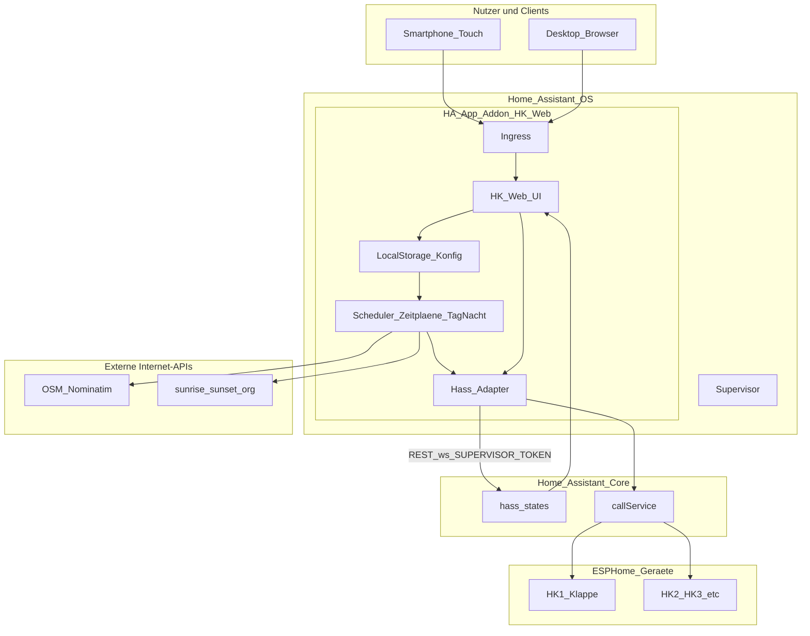

# Projekt-Architektur (Mermaid-Quelle)

Dieselbe Grafik wie in [`../diagrams/projekt-architektur.html`](../diagrams/projekt-architektur.html) – hier als **Mermaid-Quelltext** für GitHub, Notion oder andere Renderer.

**Interaktiv (Zoomen, Verschieben):** die HTML-Datei im Browser öffnen (Ordner `diagrams/` im Projektordner).

---

## Option B vs. Lovelace-Panel

| Variante | Quelle von `hass` / States |
|----------|---------------------------|
| Custom Panel in Lovelace | Home Assistant injiziert `hass` |
| **Option B (Add-on)** | **Adapter:** REST/WebSocket zum Core über **`http://supervisor/core/…`** mit **`SUPERVISOR_TOKEN`** (`homeassistant_api: true`); **Scheduler** im Add-on löst Zeitpläne aus und ruft dieselben Services auf |
